# Tsujimoto - Kanji Recognition Training

This project trains multiple neural network architectures for Japanese kanji character recognition using the expanded ETL6-9 dataset (4,154 classes, 934,622 samples - 53% more data than ETL9G alone).

## 📚 Documentation

| Document                                 | Purpose                                                                           |
| ---------------------------------------- | --------------------------------------------------------------------------------- |
| [**PROJECT_DIARY.md**](PROJECT_DIARY.md) | Complete project history, all training phases, research references, key learnings |
| [**RESEARCH.md**](RESEARCH.md)           | Research findings, architecture comparisons, citations                            |
| [**model-card.md**](model-card.md)       | HuggingFace model card with carbon footprint analysis                             |

### Quantization Documentation (4-bit BitsAndBytes)

| Document                                                     | Purpose                                 |
| ------------------------------------------------------------ | --------------------------------------- |
| [**4BIT_QUANTIZATION_GUIDE.md**](4BIT_QUANTIZATION_GUIDE.md) | Technical details, deployment checklist |

## 🚀 Quick Start

### Setup

```ps1
# Expects CUDA 13 to be available
uv pip install torch torchvision --index-url https://download.pytorch.org/whl/cu130
# Install dependencies with uv
uv sync

# Verify environment
uv run python scripts/preflight_check.py
```

### Prepare Multi-ETL Dataset

```ps1
# Process and combine ETL6, ETL7, ETL8G, ETL9G into single dataset
# (934K+ samples, 4,154 classes - includes kanji, hiragana, katakana, symbols, numerals)
uv run python scripts/prepare_dataset.py
uv run python scripts/generate_chunk_metadata.py
```

### Training

Requires CUDA 13 to be available
https://developer.nvidia.com/cuda-downloads

**Unified Training Interface** (recommended for all variants):

```ps1
# View all available training variants
uv run python scripts/train.py --help

# CNN (fast baseline, 97.18% accuracy on ETL9G)
uv run python scripts/train.py cnn --epochs 30 --batch-size 64

# RNN (best accuracy, 98.4% on ETL9G)
uv run python scripts/train.py rnn --model-type hybrid_cnn_rnn --epochs 30

# Radical RNN (radical-aware processing)
uv run python scripts/train.py radical-rnn --epochs 35 --hidden-size 256

# HierCode (recommended, 95.56% + quantizable on ETL9G)
uv run python scripts/train.py hiercode --epochs 30 --codebook-total-size 1024

# HierCode with Hi-GITA Enhancement
uv run python scripts/train.py hiercode-higita --enable-higita-enhancement --epochs 30

# Vision Transformer (ViT)
uv run python scripts/train.py vit --epochs 40 --patch-size 4

# QAT (lightweight deployment, 1.7 MB)
uv run python scripts/train.py qat --epochs 25 --batch-size 32
```

**Checkpoint Management Examples**:

```ps1
# Run 1: Trains from scratch (epochs 1-30), saves checkpoints
uv run python scripts/train.py cnn --epochs 30

# Interrupted at epoch 15? Just re-run - automatically resumes from epoch 16
uv run python scripts/train.py cnn --epochs 30

# Resume from specific checkpoint
uv run python scripts/train.py cnn --resume-from training/cnn/checkpoints/checkpoint_epoch_010.pt

# Start fresh (ignore existing checkpoints)
uv run python scripts/train.py cnn --no-checkpoint

# Keep more checkpoints (default is 5, keeps last 10)
uv run python scripts/train.py cnn --keep-last-n 10

# Change checkpoint directory
uv run python scripts/train.py cnn --checkpoint-dir training/cnn/my_checkpoints

# View all options for a specific variant
uv run python scripts/train.py cnn --help
```

**Dataset Selection**: All training scripts automatically select the best available dataset in this priority: `combined_all_etl` → `etl9g` → `etl8g` → `etl7` → `etl6`. See [Dataset Auto-Detection Priority](#dataset-auto-detection-priority) for details.

**Custom Dataset Examples**:

```ps1
# Use specific dataset
uv run python scripts/train.py cnn --data-dir dataset/etl9g --epochs 30

# Use custom dataset location
uv run python scripts/train.py cnn --data-dir /custom/path/to/dataset --epochs 30

# Test all variants with custom dataset
uv run python scripts/train.py rnn --data-dir /data/custom --model-type hybrid_cnn_rnn
uv run python scripts/train.py hiercode --data-dir /data/custom
uv run python scripts/train.py vit --data-dir /data/custom

# Direct script execution with custom dataset
python scripts/train_cnn_model.py --data-dir /path/to/dataset --epochs 30
python scripts/train_rnn.py --data-dir /path/to/dataset --model-type hybrid_cnn_rnn
```

### Checkpoint Manager API

For advanced usage, you can also use the `CheckpointManager` class directly:

```python
from scripts.checkpoint_manager import CheckpointManager

# Create manager for your approach
manager = CheckpointManager("training/cnn/checkpoints", "cnn")

# Find latest checkpoint
latest = manager.find_latest_checkpoint()

# Auto-load latest checkpoint
checkpoint_data, start_epoch = manager.find_and_load_latest_checkpoint(model, optimizer, scheduler)
if checkpoint_data:
    print(f"Resumed from epoch {start_epoch}")
else:
    print("Starting fresh training")

# Save checkpoint after epoch
manager.save_checkpoint(
    epoch=10,
    model=model,
    optimizer=optimizer,
    scheduler=scheduler,
    metrics={"val_accuracy": 0.975, "val_loss": 0.112},
    is_best=True
)

# List all checkpoints for this approach
for checkpoint_path in manager.list_all_checkpoints():
    print(checkpoint_path)
```

### Development

```ps1
# Development commands
uv sync                    # Sync dependencies
uv sync --all-extras       # Sync with dev dependencies
uv run pytest tests/       # Run tests
uv run ruff format .       # Format code
uv run ruff check . --fix  # Lint and fix
```

## 📊 Dependency Management

This project uses **uv** for fast, reliable Python dependency management.

**Install uv (one-time)**:

- Windows: `irm https://astral.sh/uv/install.ps1 | iex`
- macOS/Linux: `curl -LsSf https://astral.sh/uv/install.sh | sh`

## 🔄 Model Training Pipeline

**Complete HierCode training + quantization + export:**

```ps1
# Step 1: Train HierCode (30 epochs) using unified interface
uv run python scripts/train.py hiercode --epochs 30 --codebook-total-size 1024

# Step 1b: Copy best checkpoint (finds highest validation accuracy automatically)
uv run python scripts/copy_best_checkpoint.py --model-type hiercode

# Step 2: Quantize to INT8 (dynamic quantization recommended)
uv run python scripts/quantize_model.py --model-path training/hiercode/hiercode_model_best.pth --model-type hiercode

# Step 3: Export to ONNX (float32)
uv run python scripts/export_to_onnx_hiercode.py --model-path training/hiercode/hiercode_model_best.pth --verify

# Step 4: Export quantized INT8 to ONNX
uv run python scripts/export_quantized_to_onnx.py --model-path training/hiercode/quantized_hiercode_int8.pth --verify --test-inference

# Step 5: Export with additional ONNX quantization (ultra-lightweight)
uv run python scripts/export_4bit_quantized_onnx.py --model-path training/hiercode/quantized_hiercode_int8.pth --verify
```

| Parameter          | Type  | Default                         | Notes                       |
| ------------------ | ----- | ------------------------------- | --------------------------- |
| `--epochs`         | int   | 30                              | Training epochs             |
| `--batch-size`     | int   | 64\*                            | \*ViT=256, Hi-GITA=32       |
| `--learning-rate`  | float | 0.001\*                         | \*ViT=0.0005                |
| `--image-size`     | int   | 64                              | Input dimensions            |
| `--num-classes`    | int   | 43,528                          | Auto-detected from metadata |
| `--sample-limit`   | int   | None                            | Optional: limit samples     |
| `--optimizer`      | str   | adamw                           | adamw or sgd                |
| `--scheduler`      | str   | cosine                          | cosine or step              |
| `--weight-decay`   | float | 1e-4                            | L2 regularization           |
| `--checkpoint-dir` | str   | training/{approach}/checkpoints | Checkpoint directory        |
| `--resume-from`    | str   | None                            | Resume from checkpoint      |
| `--no-checkpoint`  | bool  | False                           | Skip checkpoint loading     |
| `--keep-last-n`    | int   | 5                               | Checkpoints to retain       |

**Result models**:

| File                                                                  | Size    | Format       | Use            |
| --------------------------------------------------------------------- | ------- | ------------ | -------------- |
| `training/hiercode/hiercode_model_best.pth`                           | 9.56 MB | PyTorch      | Fine-tuning    |
| `training/hiercode/quantized_hiercode_int8.pth`                       | 2.10 MB | PyTorch INT8 | Fast CPU       |
| `training/hiercode/exports/hiercode_opset14.onnx`                     | 6.86 MB | ONNX         | Cross-platform |
| `training/hiercode/exports/hiercode_int8_opset14.onnx`                | 6.86 MB | ONNX INT8    | Portable       |
| `training/hiercode/exports/hiercode_int8_4bit_opset14_quantized.onnx` | 1.75 MB | ONNX INT8    | **Edge**       |

### Post-Training Quantization (INT8)

Quantizes trained models to 8-bit integers for ~4x size reduction with minimal accuracy loss (<1%).

#### Basic Usage (All Model Types)

```ps1
# Quantize any trained model (HierCode, CNN, RNN, QAT, ViT, etc.)
# IMPORTANT: Always specify --model-type to match your model!
uv run python scripts/quantize_model.py --model-path training/hiercode_higita/best_hiercode_higita.pth --model-type hiercode-higita

# Supported model types: hiercode, hiercode-higita, cnn, qat, rnn, radical-rnn, vit
# Note: If --model-type is omitted, defaults to "hiercode" (may cause errors with other architectures)
```

**Supports 4 additional RNN Architectures:**

1. **`basic_rnn`** - Grid-based spatial sequence processing
   - Divides image into 8×8 grid with feature extraction
   - Bidirectional LSTM with mean pooling
   - ~2-3M parameters

2. **`stroke_rnn`** - Stroke order modeling with attention
   - Extracts stroke sequences using contour detection
   - Multi-head attention for stroke importance
   - ~3-4M parameters

3. **`radical_rnn`** - Alternative radical decomposition processing
   - Embedding-based radical sequence handling
   - Packed sequences for variable lengths
   - ~1-2M parameters

4. **`hybrid_cnn_rnn`** - Combined spatial-temporal modeling
   - CNN backbone (4 blocks) + Bi-directional LSTM
   - Concatenated global and spatial features
   - ~4-5M parameters

#### Quantization Options

**Dynamic Quantization (Recommended for cross-platform deployment)**

```ps1
# Converts weights to INT8 dynamically on GPU
# Model loaded and processed on GPU for all calculations
# Temporarily moved to CPU only for PyTorch's quantization kernel (backend requirement)
# Result automatically moved back to GPU for deployment
# Size reduction: 3-4x with minimal accuracy loss
uv run python scripts/quantize_model.py --model-path training/cnn/best_model.pth --model-type cnn

# Result saved: training/cnn/quantized_cnn_int8.pth (~4.5 MB for CNN from 15 MB)
```

**Calibrated Quantization (For higher accuracy)**

```ps1
# Uses training data to compute optimal scale factors
# Better accuracy preservation than static quantization
# Requires dataset (auto-detected)
# WARNING: Calibration has known compatibility issues with complex architectures (Hi-GITA)
# Recommended for simpler models (CNN, RNN) only
uv run python scripts/quantize_model.py --model-path training/cnn/best_model.pth --model-type cnn --calibrate
```

**Evaluate Accuracy (Note: CPU-only due to PyTorch quantization backend)**

```ps1
# Measures accuracy drop on test set
# Saves JSON results with compression metrics
# Evaluation runs on CPU (quantized models don't support GPU inference)
# WARNING: Only works if model and test set have matching class counts
uv run python scripts/quantize_model.py --model-path training/cnn/best_model.pth --model-type cnn --evaluate
```

**Ultra-Lightweight 4-bit Quantization (BitsAndBytes - for edge deployment)**

```ps1
# NF4 Quantization (Normalized Float 4-bit - recommended)
# Best accuracy/size trade-off for weights
uv run python scripts/quantize_to_4bit_bitsandbytes.py --model-path training/cnn/best_cnn_int8.pth --model-type cnn --method nf4

# FP4 Quantization (Float 4-bit)
# Standard 4-bit floating point with sign bit
uv run python scripts/quantize_to_4bit_bitsandbytes.py --model-path training/cnn/best_cnn_int8.pth --model-type cnn --method fp4

# With Double Quantization (compress scale factors for extra compression)
uv run python scripts/quantize_to_4bit_bitsandbytes.py --model-path training/cnn/best_cnn_int8.pth --model-type cnn --method nf4 --double-quant

# Result files:
# - Model: cnn_int8_4bit_NF4.pth (~1-2 MB for CNN from 15 MB)
# - Metadata: cnn_int8_4bit_NF4.json (quantization parameters and size metrics)
```

#### Quantization Methods Comparison

| Method             | File Size | Inference Memory | Accuracy | Speed | Use Case                          |
| ------------------ | --------- | ---------------- | -------- | ----- | --------------------------------- |
| Float32 (baseline) | 15 MB     | 15 MB            | 100%     | 1x    | Development, testing              |
| INT8 (PyTorch)     | 4.5 MB    | 4.5 MB           | 99-100%  | 1.2x  | CPU inference, balanced           |
| NF4 (BitsAndBytes) | ~15 MB    | 3.8 MB           | 95-98%   | 2-4x  | GPU inference, edge (recommended) |
| FP4 (BitsAndBytes) | ~15 MB    | 3.8 MB           | 94-97%   | 2-4x  | Ultra-lightweight GPU edge        |
| 4-bit Double Quant | ~15-16 MB | 3.8 MB           | 93-96%   | 2-4x  | Extreme size constraints          |

**Key Insight**: BitsAndBytes 4-bit trades file size for inference speed & memory. The model file stays ~15 MB but uses only 4 MB RAM at runtime (4x smaller), making it ideal for memory-constrained devices (edge GPUs, mobile, IoT).

**Recommended Pipeline for Edge Deployment:**

1. Train model: `train_cnn_model.py` → 15 MB (float32)
2. Option A (Balanced): Quantize to INT8 → 4.5 MB (CPU inference, 3.4x smaller)
3. Option B (GPU-Edge): Quantize to 4-bit NF4 → 15 MB file, 3.8 MB runtime (2-4x faster inference)

#### BitsAndBytes 4-bit Quantization Details

**How BitsAndBytes 4-bit Works:**

- **Dynamic quantization at inference time**: Weights stay 32-bit in model file, quantized to 4-bit during computation
- **Memory advantage**: ~4x smaller memory footprint during inference (weights loaded as 4-bit, not 32-bit)
- **Speed advantage**: 2-4x faster inference on GPUs with tensor cores (TT, RTX 40-series, etc.)
- **Storage caveat**: File size remains similar (quantization tables stored externally)
- **Key benefit**: Best inference performance per watt for edge and cloud deployment

**NF4 (Normalized Float 4-bit) - Recommended**

- 4-bit quantization scheme optimized for neural network weights
- Normalizes weight distributions to [-1, 1] range for better precision
- Best accuracy preservation (95-98% of original)
- Ideal for production models where accuracy matters
- Requires: `uv pip install bitsandbytes`

**FP4 (Float 4-bit)**

- Standard 4-bit floating point representation (1 sign + 3 exponent bits)
- Slightly faster than NF4 on some hardware
- Minor accuracy trade-off (94-97% of original)
- Use when speed is critical and 1-2% accuracy loss acceptable

**Double Quantization**

- Quantizes the scale factors themselves (4-bit weights → 4-bit scale factors)
- Saves additional 25-30% space on disk (mainly quantization tables)
- Minimal additional accuracy loss (<1%)
- Best for extreme storage constraints with still-acceptable accuracy
- Creates multiple quantized table files in checkpoints directory

**Comparison: When to Use Each Method**

| Scenario            | Recommended             | Reason                                      |
| ------------------- | ----------------------- | ------------------------------------------- |
| Cloud GPU inference | NF4 (no --double-quant) | Fast, accurate, easy to manage              |
| Edge device (CPU)   | NF4 + --double-quant    | Minimal storage, still reasonable speed     |
| Mobile/IoT          | FP4                     | Fastest, smallest, acceptable accuracy loss |
| Extreme constraints | FP4 + --double-quant    | Smallest possible, best performance/watt    |
| Research/comparison | Both (NF4 and FP4)      | Compare accuracy/speed trade-offs           |

#### Installation

```ps1
# Core quantization tools
uv pip install torch torchvision --index-url https://download.pytorch.org/whl/cu130

# For INT8 quantization (included with PyTorch)
# No additional installation needed

# For 4-bit quantization
uv pip install bitsandbytes

# Optional: For GPTQ support
uv pip install auto-gptq
```

**Custom Output Path**

```ps1
# Save quantized model to specific location
uv run python scripts/quantize_model.py --model-path training/cnn/best_model.pth --model-type cnn --output training/cnn/custom/my_quantized.pth
```

#### What Does `--evaluate` Do?

The `--evaluate` flag:

1. **Measures accuracy drop** - Runs the quantized model on the test set (90/9/1 split of dataset)
2. **Computes compression metrics** - Original size, quantized size, reduction ratio
3. **Saves results** - Writes JSON with:
   - `original_size_mb`: Pre-quantization model size
   - `quantized_size_mb`: Post-quantization model size (typically 3-4x smaller)
   - `size_reduction`: Ratio (e.g., 3.5x)
   - `quantized_accuracy`: Accuracy on test set (usually 99-100% of original)
   - `quantized_loss`: Cross-entropy loss value
   - `calibrated`: Whether calibration was used

**Note**: Evaluation runs on CPU (PyTorch INT8 dynamic quantization only supports CPU inference). For GPU inference, export to ONNX format instead.

**Example output** (`quantization_results_cnn.json`):

```json
{
  "model_type": "cnn",
  "original_size_mb": 15.47,
  "quantized_size_mb": 4.46,
  "size_reduction": 3.47,
  "quantized_accuracy": 96.8,
  "quantized_loss": 0.1523,
  "calibrated": false
}
```

#### Troubleshooting Quantization

**Error: "Inferred num_classes=X from checkpoint" doesn't match dataset**

- The checkpoint was trained on a different dataset size (e.g., combined_all_etl with 43K classes vs ETL9G with 3K)
- Solution: Don't use `--evaluate` on mismatched datasets, or train new models on the combined dataset

**Error: "quantized::linear_dynamic not available for CUDA backend"**

- PyTorch INT8 dynamic quantization only supports CPU
- Quantized models will run on CPU, not GPU
- Solution: For GPU inference, export to ONNX format with `scripts/export_quantized_to_onnx.py`

**Error: Model shape mismatch (Hi-GITA unfold issue)**

- Hi-GITA model has internal shape requirements that may not match standard data loaders
- Solution: Use simpler models (CNN, RNN) for quantization testing, or debug data loader shape

**Error: "Unsupported qscheme: per_channel_affine"**

- Different quantization backends support different schemes
- Solution: Script now uses dynamic quantization which is cross-platform compatible

#### Requirements

- **CUDA GPU required for TRAINING** - INT8 quantization uses GPU memory (optional)
- **CPU for INFERENCE** - Quantized models run on CPU by default
- **Dataset auto-detected** - Same priority as training: `combined_all_etl` → `etl9g` → `etl8g` → `etl7` → `etl6`
- **Model compatibility** - num_classes automatically inferred from checkpoint

### Deployment

```ps1
# Export to ONNX
uv run python scripts/convert_to_onnx.py --model-path training/cnn/best_kanji_model.pth

# Export to SafeTensors
uv run python scripts/convert_to_safetensors.py --model-path training/cnn/best_kanji_model.pth

# Quantize INT8 PyTorch to ultra-lightweight ONNX
uv run python scripts/convert_int8_pytorch_to_quantized_onnx.py --model-path training/hiercode/quantized_hiercode_int8.pth
```

### Inference (Python)

```python
import onnxruntime as ort
import numpy as np

# GPU providers auto-fallback to CPU if not available
providers = [
    ("CUDAExecutionProvider", {"device_id": 0}),
    ("CPUExecutionProvider", {}),
]
sess = ort.InferenceSession('training/hiercode/exports/hiercode_int8_quantized_quantized_int8_onnx_opset14.onnx', providers=providers)
image = np.random.randn(1, 1, 64, 64).astype(np.float32)  # 64x64 grayscale
logits = sess.run(None, {'input_image': image})[0]
prediction = np.argmax(logits[0])
```

## 📁 Project Structure

```
├── PROJECT_DIARY.md          ← Full project documentation (START HERE)
├── README.md                 ← This file (quick reference)
├── model-card.md             ← HuggingFace model card
├── RESEARCH.md               ← Research findings and references
│
├── scripts/                  ← Training and deployment scripts
│   ├── train_cnn_model.py  ← CNN baseline
│   ├── train_qat.py          ← Quantization-aware training
│   ├── train_radical_rnn.py  ← RNN variant
│   ├── train_hiercode.py     ← HierCode approach
│   ├── train_vit.py          ← Vision Transformer
│   ├── convert_to_onnx.py    ← ONNX export
│   ├── convert_to_safetensors.py ← SafeTensors export
│
├── training/                ← Trained model checkpoints and exports
```

### Training Folder Structure

The `training/` directory is automatically organized by model architecture:

```mermaid
graph TD
    A["training/"] --> B["cnn/"]
    A --> C["rnn/"]
    A --> D["hiercode/"]
    A --> E["qat/"]
    A --> F["vit/"]
    A --> G["hiercode_higita/"]

    B --> B1["checkpoints/"]
    B --> B2["checkpoint_epoch_010.pt"]
    B --> B3["best_cnn_model.pth"]

    C --> C1["checkpoints/"]
    C --> C2["checkpoint_epoch_015.pt"]
    C --> C3["best_rnn_model.pth"]

    D --> D1["checkpoints/"]
    D --> D2["checkpoint_epoch_020.pt"]
    D --> D3["hiercode_model_best.pth"]
    D --> D4["quantized_hiercode_int8.pth"]
    D --> D5["exports/"]

    D5 --> D5a["hiercode_opset14.onnx"]
    D5 --> D5b["hiercode_int8_opset14.onnx"]
    D5 --> D5c["hiercode_int8_4bit_quantized.onnx"]

    E --> E1["checkpoints/"]
    E --> E2["checkpoint_epoch_012.pt"]
    E --> E3["best_qat_model.pth"]

    F --> F1["checkpoints/"]
    F --> F2["checkpoint_epoch_008.pt"]
    F --> F3["best_vit_model.pth"]

    G --> G1["checkpoints/"]
    G --> G2["best_hiercode_higita.pth"]
    G --> G3["quantized_hiercode_higita_int8.pth"]

    style A fill:#e1f5ff
    style B fill:#fff3e0
    style C fill:#f3e5f5
    style D fill:#e8f5e9
    style E fill:#fce4ec
    style F fill:#ede7f6
    style G fill:#e0f2f1
    style B1 fill:#fff9c4
    style D1 fill:#c8e6c9
    style D5 fill:#a5d6a7
```



**Key Points**:

- Each architecture gets its own folder: `cnn/`, `rnn/`, `hiercode/`, `qat/`, `vit/`, `hiercode_higita/`
- Each folder automatically creates a `checkpoints/` subdirectory for resumption
- Best models are saved as `*_model_best.pth` or `best_*_model.pth`
- Quantized variants stored in same folder (e.g., `quantized_hiercode_int8.pth`)
- Exported ONNX models stored in `exports/` subdirectory
- Checkpoints auto-delete old files, keeping only last 5 by default (configurable with `--keep-last-n`)

**Automatic Creation**:

All folders and checkpoints are created automatically by training scripts. No manual setup required:

```ps1
# This automatically creates: training/cnn/checkpoints/
uv run python scripts/train.py cnn --data-dir dataset

# This automatically creates: training/hiercode/checkpoints/ and training/hiercode/exports/
uv run python scripts/train.py hiercode --data-dir dataset
uv run python scripts/export_to_onnx_hiercode.py --model-path training/hiercode/hiercode_model_best.pth
```

**Custom Checkpoint Directory**:

```ps1
# Use custom checkpoint path (creates if doesn't exist)
uv run python scripts/train.py cnn --data-dir dataset --checkpoint-dir training/cnn/my_custom_checkpoints
```

## 📊 Results Comparison (on ETL9G)

| Architecture           | Accuracy | Model Size    | Speed    | Format       | Deployment  | Status      |
| ---------------------- | -------- | ------------- | -------- | ------------ | ----------- | ----------- |
| **CNN**                | 97.18%   | 6.6 MB        | ⚡⚡⚡   | PyTorch      | Python/ONNX | ✅ Prod     |
| **RNN**                | 98.4%    | 23 MB         | ⚡⚡     | PyTorch      | Python/ONNX | ✅ Prod     |
| **HierCode**           | 95.56%   | 2.1 MB (INT8) | ⚡⚡⚡   | PyTorch/ONNX | Python/ONNX | ✅ Prod     |
| **HierCode INT8 ONNX** | 95.56%   | **1.67 MB**   | ⚡⚡⚡   | ONNX         | Edge/Mobile | ✅ Prod     |
| **QAT**                | 62%      | 1.7 MB        | ⚡⚡⚡⚡ | ONNX         | Embedded    | ✅ Done     |
| **ViT**                | —        | —             | —        | —            | —           | 📋 Explored |

**Dataset Expansion**: ETL6-9 combines 4 datasets (ETL6, ETL7, ETL8G, ETL9G) → 934K samples, ~4,154 classes | Expected accuracy gain: +2-3%

## 🎯 Unified Dataset Preparation

Automatically prepare all available ETLCDB datasets:

```ps1
# Download datasets from: http://etlcdb.db.aist.go.jp/download-links/
# Extract to: ETL1/, ETL2/, ..., ETL9G/ directories as needed

# Auto-detect and prepare ALL available datasets + combine:
uv run python scripts/prepare_dataset.py

# Process specific datasets only:
uv run python scripts/prepare_dataset.py --only etl9g etl8g etl7

# Process but don't combine:
uv run python scripts/prepare_dataset.py --no-combine

# Custom output directory:
uv run python scripts/prepare_dataset.py --output-dir my_datasets
```

**Features**:

- ✅ Auto-detects available ETL directories
- ✅ Processes ETL1-9G (all formats supported)
- ✅ Combines into single unified dataset
- ✅ Handles chunked output for large datasets
- ✅ Generates metadata for each dataset

### Dataset Auto-Detection Priority

All training scripts **automatically select the best available dataset** using this priority order:

```
1. combined_all_etl  ← 934K samples, 43,427 classes (recommended if available)
2. etl9g             ← 607K samples, 3,036 classes (default if combined not available)
3. etl8g             ← 153K samples, 956 classes
4. etl7              ← 16.8K samples, 48 classes
5. etl6              ← 157K samples, 114 classes
6. etl1              ← Legacy format support
```

**What this means**:

- If you prepare the combined dataset → all training scripts automatically use it (+53% more data)
- If only ETL9G exists → scripts use ETL9G
- No need to modify training commands - they adapt automatically!

```ps1
# Example: Prepare combined dataset
uv run python scripts/prepare_dataset.py

# Then train - automatically uses combined_all_etl (934K samples)
uv run python scripts/train.py cnn --data-dir dataset
uv run python scripts/train.py qat --data-dir dataset
uv run python scripts/train.py radical-rnn --data-dir dataset
uv run python scripts/train.py vit --data-dir dataset
uv run python scripts/train.py hiercode --data-dir dataset
```

**Training Impact**:
| Dataset | Classes | Samples | Per-Epoch Time | Expected Accuracy |
|---------|---------|---------|---|---|
| ETL9G only | 3,036 | 607K | ~1.0x | Baseline |
| Combined (ETL6-9) | 4,154 | 934K (+53%) | ~1.5-1.8x | **+2-3% gain** |

### Character Coverage Expansion

```
Current (ETL9G only):
├─ Kanji: 2,965 (JIS Level 1)
├─ Hiragana: 71
└─ Total: 3,036 classes, 607K samples

Expanded (ETL6-9):
├─ Kanji: 2,965 (JIS Level 1)
├─ Hiragana: ~75 (ETL8G + ETL9G)
├─ Katakana: 46 (ETL6)
├─ Numerals: 10 (ETL6)
├─ Symbols: 32 (ETL6)
├─ ASCII: 26 (ETL6)
└─ Total: ~4,154 classes, 934K samples (+53%)
```

### Training Integration

```python
from scripts.load_multi_etl import load_etl_dataset

# Load combined ETL6-9 dataset
X, y, metadata = load_etl_dataset("dataset/etl6789_combined")
num_classes = metadata["num_classes"]  # ~4,154

# Use in training (compatible with all existing scripts)
model = train(X, y, num_classes=num_classes, ...)
```

**Performance Impact**:

- Training time: ~1.5-2.0x longer per epoch
- Expected accuracy gain: +2-3%
- Memory: ~7.5 GB (vs 4.6 GB for ETL9G alone)

### How Dataset Auto-Detection Works

All training scripts use intelligent dataset selection:

```python
# Priority order (checked in this sequence)
dataset_priority = [
    "combined_all_etl",  # 934K samples, 43,427 classes (best)
    "etl9g",             # 607K samples, 3,036 classes (default)
    "etl8g",             # 153K samples, 956 classes
    "etl7",              # 16.8K samples, 48 classes
    "etl6",              # 157K samples, 114 classes
    "etl1",              # Legacy format
]

# Script automatically selects first one it finds:
for dataset in dataset_priority:
    if Path(f"dataset/{dataset}").exists():
        return load_dataset(f"dataset/{dataset}")  # Use this one!
```

**Training Variants** (accessed via unified entry point):

All training variants use the unified `scripts/train.py` entry point:

```ps1
# View all variants
uv run python scripts/train.py --help

# Train any variant with auto-detected dataset
uv run python scripts/train.py cnn --epochs 30
uv run python scripts/train.py rnn --epochs 30
uv run python scripts/train.py hiercode --epochs 30
uv run python scripts/train.py qat --epochs 25
uv run python scripts/train.py vit --epochs 40
uv run python scripts/train.py radical-rnn --epochs 35
uv run python scripts/train.py hiercode-higita --epochs 30
```

Individual training scripts (for direct execution or programmatic use):

- `scripts/train_cnn_model.py` - CNN baseline
- `scripts/train_qat.py` - Quantization-aware training
- `scripts/train_radical_rnn.py` - RNN variant
- `scripts/train_vit.py` - Vision Transformer
- `scripts/train_hiercode.py` - HierCode approach
- `scripts/train_hiercode_higita.py` - Hi-GITA variant

**Example**:

```
Your dataset/ directory contains:
├── combined_all_etl/      ← This exists
├── etl9g/
└── etl8g/

When you run: uv run python scripts/train.py cnn --data-dir dataset
↓
Script finds combined_all_etl/ first → uses it (934K samples)
↓
Training automatically benefits from +53% more data!
```

See **Phase 7: Dataset Expansion** in [PROJECT_DIARY.md](PROJECT_DIARY.md) for complete details.

### Dataset Details

| Dataset      | Classes | Samples | Content                               |
| ------------ | ------- | ------- | ------------------------------------- |
| **ETL6**     | 114     | 157,662 | Katakana + Numerals + Symbols + ASCII |
| **ETL7**     | 48      | 16,800  | Hiragana                              |
| **ETL8G**    | 956     | 152,960 | Educational Kanji + Hiragana          |
| **ETL9G**    | 3,036   | 607,200 | JIS Level 1 Kanji + Hiragana          |
| **Combined** | ~4,154  | 934,622 | Complete character set                |

See **Phase 7: Dataset Expansion** in [PROJECT_DIARY.md](PROJECT_DIARY.md) for complete details.

## 🎯 Model Recommendations

- **Best Accuracy**: RNN (98.4%) - Use for high-precision applications
- **Best Balance**: CNN (97.18%) - Fast, accurate, easy to deploy
- **Best for Deployment**: HierCode INT8 ONNX (1.67 MB) - Ultra-lightweight, 82% size reduction
- **Best for Edge**: HierCode INT8 ONNX - Runs on Raspberry Pi, Jetson Nano, IoT devices
- **Best for Mobile**: HierCode INT8 ONNX - CoreML/ONNX Runtime support

## 🔗 Resources

- **ETL9G Dataset**: http://etlcdb.db.aist.go.jp/download-links/
- **Research References**: See RESEARCH.md or PROJECT_DIARY.md
- **Model Card**: [model-card.md](model-card.md) (HuggingFace format)
- **Deployment Guide**: See model-specific sections in PROJECT_DIARY.md

## 📖 Related Papers (Building on HierCode)

Recent research (2022-2025) extends HierCode with improved techniques:

- **Hi-GITA** (2505.24837, May 2025): Hierarchical multi-granularity image-text alignment, 20% improvement
- **RZCR** (2207.05842, July 2022): Knowledge graph reasoning over radicals
- **STAR** (2210.08490, October 2022): Stroke + radical level decompositions
- **MegaHan97K** (2506.04807, June 2025): 97K character benchmark dataset

See [PROJECT_DIARY.md](PROJECT_DIARY.md) Phase 6 for detailed analysis and integration opportunities.

## ❓ FAQ

**Q: Where's the full project documentation?**
A: [PROJECT_DIARY.md](PROJECT_DIARY.md) - Complete history, all approaches, results, references.

**Q: Which model should I use?**
A: See "Model Recommendations" above. CNN for speed (97.18%), RNN for accuracy (98.4%), HierCode INT8 for deployment (1.67 MB, 82% reduction).

**Q: Which dataset do the training scripts use?**
A: Scripts auto-detect in this priority: `combined_all_etl` (934K, recommended) → `etl9g` (607K, default) → `etl8g` → `etl7` → `etl6`. Prepare the combined dataset with `uv run python scripts/prepare_dataset.py` and training scripts will automatically use it (+53% more data).

**Q: Why isn't my training using the combined dataset?**
A: Prepare it first: `uv run python scripts/prepare_dataset.py`. Scripts check for `dataset/combined_all_etl/chunk_info.json` before falling back to `dataset/etl9g/`.

**Q: How do I handle training crashes?**
A: All scripts have checkpoint/resume system built in. Checkpoints auto-save after each epoch in `training/{approach}/checkpoints/`. Resume with `--resume-from training/{approach}/checkpoints/checkpoint_epoch_015.pt` or it auto-detects the latest checkpoint if you just re-run the command.

**Q: What approaches support automatic checkpoint resumption?**
A: All 6 training scripts: `train_cnn_model.py`, `train_qat.py`, `train_radical_rnn.py`, `train_vit.py`, `train_hiercode.py`, `train_hiercode_higita.py`. Each uses its own checkpoint folder: `training/cnn/checkpoints/`, `training/qat/checkpoints/`, `training/rnn/checkpoints/`, `training/vit/checkpoints/`, `training/hiercode/checkpoints/`, `training/hiercode_higita/checkpoints/`.

**Q: How do I resume from the latest checkpoint?**
A: Just re-run the training command and it automatically resumes from the latest checkpoint found:

```ps1
# First run - trains from scratch
uv run python scripts/train.py cnn --epochs 30

# If interrupted, just run again - resumes automatically
uv run python scripts/train.py cnn --epochs 30
```

**Q: How do I start fresh training and ignore old checkpoints?**
A: Use the `--no-checkpoint` flag:

```ps1
uv run python scripts/train.py cnn --no-checkpoint
```

**Q: Can I manually specify which checkpoint to resume from?**
A: Yes, use `--resume-from`:

```ps1
uv run python scripts/train.py cnn --resume-from training/cnn/checkpoints/checkpoint_epoch_010.pt
```

**Q: How many checkpoints are kept?**
A: By default, the 5 most recent checkpoints are kept per approach. Older checkpoints auto-delete to save disk space. Customize with `--keep-last-n N` flag.

**Q: How do I deploy to edge/mobile?**
A: Use `hiercode_int8_quantized_quantized_int8_onnx_opset14.onnx` (1.67 MB). Supports ONNX Runtime, TensorRT, CoreML, TVM.

**Q: Can I use pre-trained models?**
A: Models in `training/` are ready to use. Load with `torch.load()` or `ort.InferenceSession()` for ONNX.

**Q: How do I add new training approaches?**
A: See `scripts/optimization_config.py` for unified config system. Inherit from `OptimizationConfig` class.

**Q: Why use `uv run python` instead of just `python`?**
A: `uv` provides isolated, reproducible environments with locked dependency versions. Prevents version conflicts and ensures consistency across machines.

## 📝 System Requirements

- **OS**: Windows 11, Linux, or macOS
- **Python**: 3.11+ (tested with 3.13)
- **GPU**: NVIDIA GPU with CUDA 11.8+ recommended
- **RAM**: 8+ GB (16+ GB recommended)
- **Storage**: 15+ GB free space
